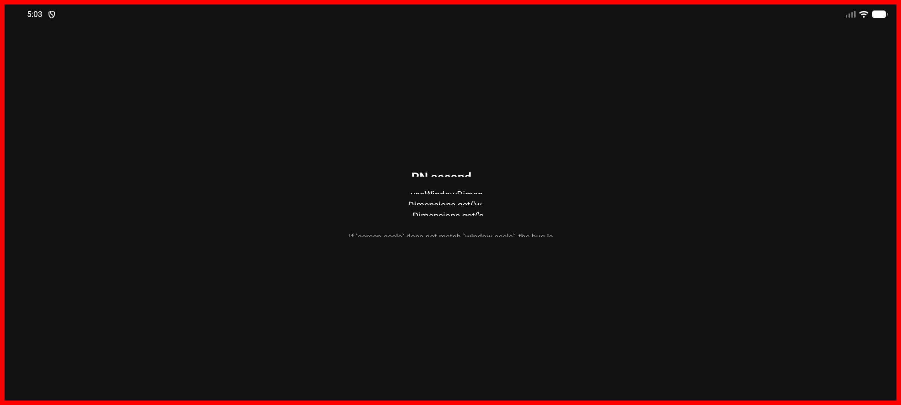
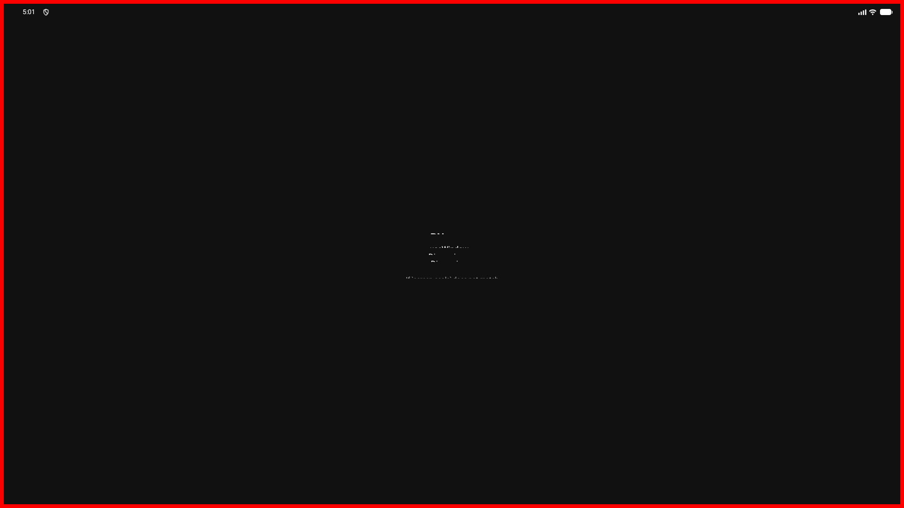
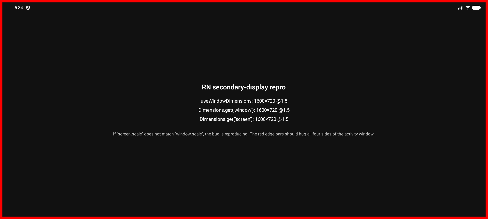

# RN secondary-display `Dimensions.get('screen')` bug

Android-only. When a React Native activity is running on a secondary
display (Samsung DeX, an external monitor, a virtual display, or
`am start --display N`), `Dimensions.get('screen')` reports the primary
display's `scale`/density instead of the activity's actual display.

`Dimensions.get('window')` and `useWindowDimensions()` are correct. Only
`screen` is wrong.

## How to reproduce

Tested on a Pixel 9 Pro AVD at API 36 with a virtual secondary display
attached.

1. Boot the AVD:

   ```sh
   ~/Library/Android/sdk/emulator/emulator -avd Pixel_9_Pro
   ```

2. Add a virtual secondary display. The Pixel 9 Pro primary is at 3.0x
   density, so picking 240dpi (1.5x) for the secondary makes the bug
   obvious:

   ```sh
   adb emu multidisplay add 1 2400 1080 240 0
   ```

   A second emulator window opens.

3. Build + install the reproducer, start Metro:

   ```sh
   cd ReproducerApp
   npm install
   npm run android
   npm start    # in a second terminal
   ```

4. Force-stop the app, then start it onto the secondary display. Use the
   display id assigned by `multidisplay add` (check
   `adb shell dumpsys display`):

   ```sh
   adb shell am force-stop com.reproducerapp
   adb shell am start -n com.reproducerapp/.MainActivity --display 3
   ```

5. Look at `adb logcat | grep "\[repro\]"`, or capture the secondary
   display:

   ```sh
   SF_ID=$(adb shell dumpsys SurfaceFlinger --display-id \
            | awk '/Virtual display/ {print $2; exit}')
   adb shell screencap -d "$SF_ID" -p /sdcard/d.png
   adb pull /sdcard/d.png ./repro-secondary.png
   ```

   `screencap` without `-d` only sees the primary display.

## Expected vs actual

Expected: `screen.scale === window.scale` when the activity is on a single
display.

Actual, on the secondary at 2400x1080 @ 240dpi (1.5x):

```
Dimensions.get('window'): { width: 1600, height: 720, scale: 1.5 }
Dimensions.get('screen'): { width: 800,  height: 360, scale: 3   }
```

`screen.scale` is 3 (the primary display's density), and `screen.width`
ends up at 800 because RN appears to be dividing the secondary's 2400
pixels by the primary's scale.

## Screenshots

Red border bars hug the activity window in both cases, so the React
Native surface itself is sized to the secondary display. The bug is what
JS sees in the middle of the screen.

Reproducer on a 2400x1080 @ 240dpi secondary:



Same reproducer on a 1920x1080 @ 160dpi (1.0x) secondary. Text renders
small because the display is at 1.0 density, which is fine — but
`Dimensions.get('screen').scale` still reports `3`:



Same 2400x1080 @ 240dpi secondary with the proof-of-concept fix applied
(activity-scoped metrics pushed into `DisplayMetricsHolder` and JS
notified via `DeviceInfoModule.emitUpdateDimensionsEvent()`).
`screen.scale` now matches `window.scale`, and text renders crisply:



## Proof-of-concept fix (app-side workaround)

`FixProofOfConceptApp/` is the same RN 0.85.3 template app, with a single
modified file: `android/app/src/main/java/com/fixpoc/MainActivity.kt`. It
demonstrates that the bug can be worked around entirely from app code
without patching React Native, which both confirms the root cause is in
RN's `DisplayMetricsHolder` and gives downstream app authors a stopgap.

What it does:

1. **Before `super.onCreate()`**, push activity-scoped `DisplayMetrics`
   into `DisplayMetricsHolder` via the public `setWindowDisplayMetrics` /
   `setScreenDisplayMetrics`. The `screen` entry is filled from the
   activity's own `Display.getRealMetrics()` instead of the
   `WindowManager.defaultDisplay.getRealMetrics()` that RN uses, so it
   reflects the secondary display.
2. **On `ReactInstanceEventListener.onReactContextInitialized`** and on
   every `onConfigurationChanged`, re-push the metrics and call
   `DeviceInfoModule.emitUpdateDimensionsEvent()` (via reflection — that
   method's containing class is `internal` in Kotlin) so JS receives a
   `change` event with the corrected values.

To try it:

```sh
cd FixProofOfConceptApp
npm install
npm run android
npm start    # second terminal

adb shell am force-stop com.fixpoc
adb shell am start -n com.fixpoc/.MainActivity --display 3
```

The on-screen `Dimensions.get('screen')` row will report the same `scale`
as `window` — matching the `repro-with-fix-poc.png` screenshot above.

This is a workaround, not a proper fix. The proper fix lives in React
Native — see the "Suggested fix" section above.
